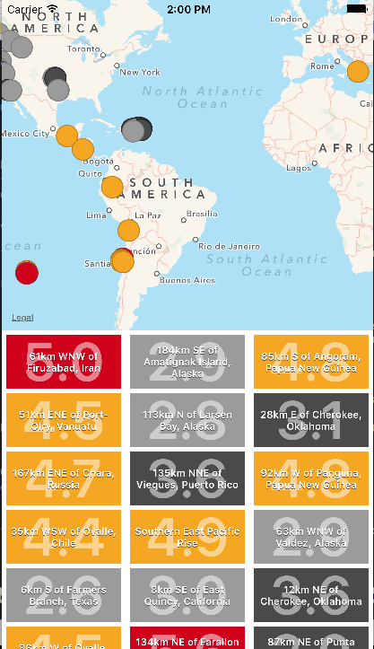
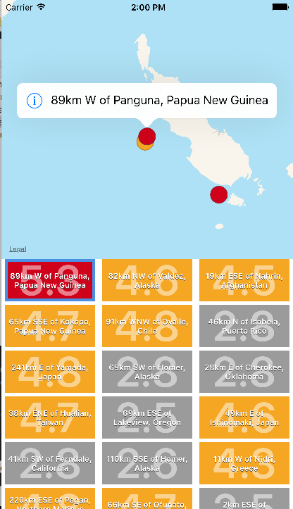
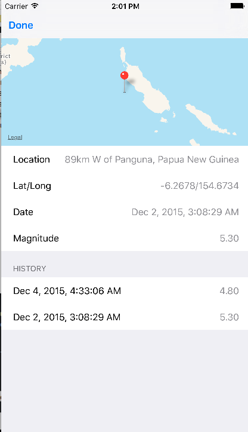

# Earthshakes

An iOS application for viewing recent earthquake data using the
[USGS Earthquake Hazards Program](http://ehp2-earthquake.wr.usgs.gov/fdsnws/event/1/).

## Downloading

Clone the repo and open/run in Xcode. You will need Xcode or the Command Line Tools installed.

```
git clone git@github.com:n8armstrong/earthshakes.git
```

## Tech Stack

- Objective-C
- [Carthage](https://github.com/Carthage/Carthage)
- [Specta](https://github.com/specta/specta) and [Expecta](https://github.com/specta/expecta) for tests

## Screenshots


&nbsp;
&nbsp;

&nbsp;
&nbsp;

